# Online Compiler - Judge0-Compatible Code Execution Service

Online Compiler is a full-stack code execution project with two main use cases:

- A browser-based online IDE where users can write code, provide stdin, run programs, and request AI review.
- A backend compiler service that behaves like a small Judge0-compatible API, so another project such as an online judge can submit code, receive tokens, poll results, and compare outputs without changing its Judge0-style integration logic.

The service is split into an API process and a worker process. The API accepts submissions, stores jobs in MongoDB, writes temporary source/input files, and enqueues work in Redis/BullMQ. The worker consumes jobs, compiles/runs code with local language runtimes, updates final status in MongoDB, and deletes temporary files.

## Table of Contents

- [Features](#features)
- [System Architecture](#system-architecture)
- [Folder Structure](#folder-structure)
- [Tech Stack](#tech-stack)
- [Supported Languages](#supported-languages)
- [Environment Variables](#environment-variables)
- [Local Setup](#local-setup)
- [Docker Setup](#docker-setup)
- [Backend API Reference](#backend-api-reference)
- [Judge0 Compatibility](#judge0-compatibility)
- [Data Model](#data-model)
- [Flow Diagrams](#flow-diagrams)
- [Execution Details](#execution-details)
- [Security Notes](#security-notes)
- [Troubleshooting](#troubleshooting)
- [Deployment Notes](#deployment-notes)

## Features

### Compiler Service Features

- Judge0-style language list endpoint.
- Judge0-style status list endpoint.
- Judge0-style single submission endpoint.
- Judge0-style batch submission endpoint.
- Token-based result polling.
- `base64_encoded=false` plain text responses by default.
- Optional base64 encode/decode support when `base64_encoded=true`.
- `fields=*` support and comma-separated field selection.
- Auth-protected batch POST using `X-Auth-Token`.
- Public batch polling GET so clients with result tokens can poll without auth.
- Queue health endpoint.
- MongoDB-backed job persistence.
- Redis/BullMQ-backed execution queue.
- Worker concurrency support.
- C, C++, Java, JavaScript, and Python execution.
- Judge0-compatible status IDs for accepted, wrong answer, compilation error, runtime error, internal error, and queue states.

### Browser IDE Features

- React/Vite frontend.
- Monaco code editor.
- Language selector.
- Input/stdin textarea.
- Output panel.
- Run code button.
- `Cmd/Ctrl + Enter` run shortcut.
- AI code review endpoint powered by Google Gemini.

### Worker Features

- Compiles C with `gcc`.
- Compiles C++ with `g++`.
- Compiles Java with `javac` and runs with `java`.
- Runs Python with `python3`.
- Runs JavaScript with `node`.
- Generates isolated temporary file names per job.
- Renames Java public classes to avoid class-name/file-name collisions.
- Uses `.cjs` for JavaScript jobs so CommonJS `require()` works even though the backend package uses ESM.
- Strips ANSI codes from output.
- Normalizes trailing whitespace before expected-output comparison.
- Cleans up temporary code, input, and output files after execution.

## System Architecture

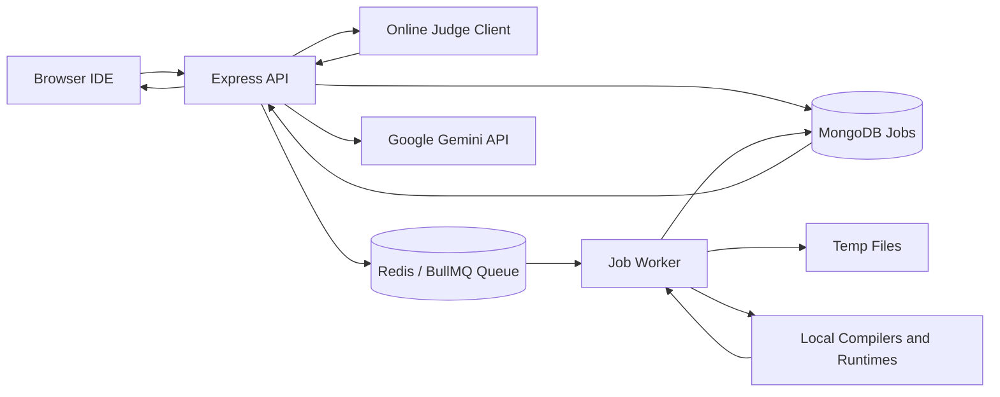

## Folder Structure

```text
Online-Compiler-/
  README.md
  backend/
    index.js
    jobQueue.js
    jobWorker.js
    judge0Compat.js
    package.json
    docker-compose.yml
    Dockerfile
    Dockerfile.api
    Dockerfile.worker
    config/
      db.js
      redis.js
    controllers/
      executeC.js
      executeCpp.js
      executeJava.js
      executeJs.js
      executePy.js
      generateAiResponse.js
    models/
      jobModel.js
    utils/
      generateFile.js
  frontend/
    package.json
    vite.config.js
    utils/
      axiosClient.js
    src/
      App.jsx
      main.jsx
      App.css
      index.css
```

## Tech Stack

| Layer | Technology |
| --- | --- |
| Frontend | React, Vite |
| Code editor | Monaco Editor |
| Styling | Tailwind CSS, DaisyUI |
| Backend API | Node.js, Express |
| Database | MongoDB, Mongoose |
| Queue | BullMQ |
| Queue broker | Redis / ioredis |
| AI review | Google Gemini API |
| Containerization | Docker, Docker Compose |
| C compiler | gcc |
| C++ compiler | g++ |
| Java compiler/runtime | javac, java |
| Python runtime | python3 |
| JavaScript runtime | node |

## Supported Languages

### Judge0-Compatible Language IDs

| Judge0 language_id | Name | Internal key |
| --- | --- | --- |
| `48` | C (GCC 7.4.0) | `c` |
| `49` | C (GCC 8.3.0) | `c` |
| `50` | C (GCC 9.2.0) | `c` |
| `52` | C++ (GCC 7.4.0) | `cpp` |
| `53` | C++ (GCC 8.3.0) | `cpp` |
| `54` | C++ (GCC 9.2.0) | `cpp` |
| `62` | Java (OpenJDK 13.0.1) | `java` |
| `63` | JavaScript (Node.js 12.14.0) | `js` |
| `71` | Python (3.8.1) | `py` |
| `109` | Python (3.x) | `py` |

### Browser IDE Languages

The frontend selector currently exposes:

- C++
- C
- Python
- Java

The backend compatibility layer also supports JavaScript for Judge0-style API submissions.

## Environment Variables

Create `backend/.env`:

```env
PORT=8000
MONGO_URI=mongodb://127.0.0.1:27017/online-compiler

REDIS_URL=
REDIS_HOST=127.0.0.1
REDIS_PORT=6379
REDIS_USERNAME=
REDIS_PASSWORD=

MY_COMPILER_SECRET=replace_with_a_strong_secret
CORS_ORIGIN=http://localhost:5173

GOOGLE_GEMINI_API=replace_with_gemini_api_key
GENAI_MODEL=gemini-2.0-flash
```

Create `frontend/.env` or `frontend/.env.production`:

```env
VITE_API_URL=http://localhost:8000
```

Do not commit real secret values to a public repository.

## Local Setup

### Prerequisites

Install these locally if you run without Docker:

- Node.js
- npm
- MongoDB
- Redis
- gcc
- g++
- python3
- Java JDK

### Install Backend Dependencies

```bash
cd backend
npm install
```

### Install Frontend Dependencies

```bash
cd frontend
npm install
```

### Start Backend API and Worker Together

Use this for local development without Docker:

```bash
cd backend
npm run local
```

This starts:

- `node index.js`
- `node jobWorker.js`

Both are needed. If only the API is running, submissions will be accepted but may stay stuck in `In Queue`.

### Start Backend with Nodemon

```bash
cd backend
npm run dev
```

The dev script ignores the `temp` directory so source/input/output file changes do not restart the server during code execution.

### Start Frontend

```bash
cd frontend
npm run dev
```

Default URLs:

```text
Frontend: http://localhost:5173
Backend:  http://localhost:8000
```

## Docker Setup

The Docker Compose setup runs three services:

- `api`: Express server on port `8000`.
- `worker`: BullMQ worker with compilers installed.
- `redis`: Redis broker.

```bash
cd backend
docker compose up --build
```

The API Docker image is intentionally smaller and does not install compilers. The worker image installs compilers and runtimes because execution happens in the worker.

## Backend API Reference

### Health

```http
GET /health
```

Returns queue counts:

```json
{
  "ok": true,
  "queue": {
    "waiting": 0,
    "active": 0,
    "completed": 0,
    "failed": 0,
    "delayed": 0
  }
}
```

### Languages

```http
GET /languages
GET /languages/:id
```

Returns Judge0-style language metadata.

### Statuses

```http
GET /statuses
```

Returns Judge0-style status IDs and descriptions.

### Judge0 Single Submission

```http
POST /submissions?base64_encoded=false
```

Request body:

```json
{
  "source_code": "print('hello')",
  "language_id": 109,
  "stdin": "",
  "expected_output": "hello\n"
}
```

Response without `wait=true`:

```json
{
  "token": "65f..."
}
```

With wait:

```http
POST /submissions?base64_encoded=false&wait=true&fields=*
```

Returns a Judge0-style submission result after completion or timeout.

### Judge0 Single Result Polling

```http
GET /submissions/:token?base64_encoded=false&fields=*
```

Returns a Judge0-style result for one token.

### Judge0 Batch Submission

```http
POST /submissions/batch?base64_encoded=false
X-Auth-Token: <MY_COMPILER_SECRET>
```

Request body:

```json
{
  "submissions": [
    {
      "source_code": "print(input())",
      "language_id": 109,
      "stdin": "42",
      "expected_output": "42\n"
    }
  ]
}
```

Response:

```json
[
  {
    "token": "65f..."
  }
]
```

Only `POST /submissions/batch` requires `X-Auth-Token`.

### Judge0 Batch Polling

```http
GET /submissions/batch?tokens=<token1>,<token2>&base64_encoded=false&fields=*
```

Response:

```json
{
  "submissions": [
    {
      "stdout": "42\n",
      "time": "0.041",
      "memory": null,
      "stderr": null,
      "token": "65f...",
      "compile_output": null,
      "message": null,
      "status": {
        "id": 3,
        "description": "Accepted"
      },
      "language_id": 109,
      "status_id": 3
    }
  ]
}
```

`GET /submissions/batch` is public/unauthenticated because the client already has the result token.

### Legacy Browser IDE Run

```http
POST /run
```

Request body:

```json
{
  "language": "cpp",
  "code": "#include <iostream>\nint main(){std::cout << 5;}",
  "input": ""
}
```

Response:

```json
{
  "success": true,
  "jobId": "65f...",
  "language": "cpp",
  "code": "..."
}
```

### Legacy Browser IDE Status

```http
GET /status/:jobId
```

Returns the full internal job document.

### AI Review

```http
POST /ai-review
```

Request body:

```json
{
  "code": "console.log('hello')"
}
```

Response:

```json
{
  "success": true,
  "review": "..."
}
```

## Judge0 Compatibility

### Supported Status IDs

| status_id | Description |
| --- | --- |
| `1` | In Queue |
| `2` | Processing |
| `3` | Accepted |
| `4` | Wrong Answer |
| `5` | Time Limit Exceeded |
| `6` | Compilation Error |
| `7` | Runtime Error (SIGSEGV) |
| `8` | Runtime Error (SIGXFSZ) |
| `9` | Runtime Error (SIGFPE) |
| `10` | Runtime Error (SIGABRT) |
| `11` | Runtime Error (NZEC) |
| `12` | Runtime Error (Other) |
| `13` | Internal Error |
| `14` | Exec Format Error |

### Current Worker Status Mapping

| Event | Internal status | Judge0 status_id |
| --- | --- | --- |
| Job saved | `pending` | `1` |
| Worker starts job | `processing` | `2` |
| Output matches expected output | `success` | `3` |
| Output does not match expected output | `error` | `4` |
| Compilation fails | `error` | `6` |
| Runtime fails | `error` | `11` |
| Queue enqueue fails | `error` | `13` |

### Response Encoding

Default online judge integration should use:

```text
base64_encoded=false
```

That means:

- `stdout` is plain text.
- `stderr` is plain text.
- `compile_output` is plain text.

If `base64_encoded=true`, the API decodes incoming code/stdin/expected output and encodes outgoing text fields.

### Field Selection

The API supports:

```text
fields=*
fields=stdout,status_id,stderr,compile_output,time,memory
```

If `fields` is omitted, the default result includes:

- `stdout`
- `time`
- `memory`
- `stderr`
- `token`
- `compile_output`
- `message`
- `status`
- `status_id`
- `language_id`

## Data Model

### Job

The `Job` model stores both legacy compiler UI fields and Judge0-compatible result fields.

Key fields:

- `language`
- `languageId`
- `sourceCode`
- `stdin`
- `expectedOutput`
- `filePath`
- `inputFilePath`
- `submittedAt`
- `startedAt`
- `completedAt`
- `status`
- `statusId`
- `output`
- `stdout`
- `stderr`
- `compileOutput`
- `message`
- `exitCode`
- `exitSignal`
- `time`
- `wallTime`
- `memory`

## Flow Diagrams

### Local Browser IDE Run Flow

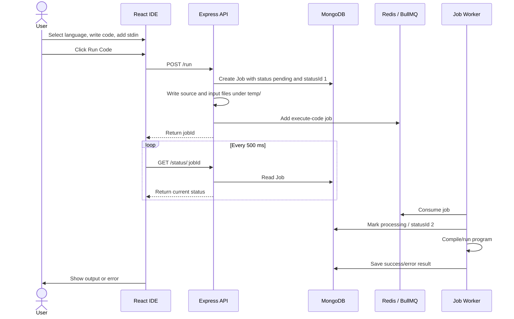

### Judge0 Batch Submission Flow

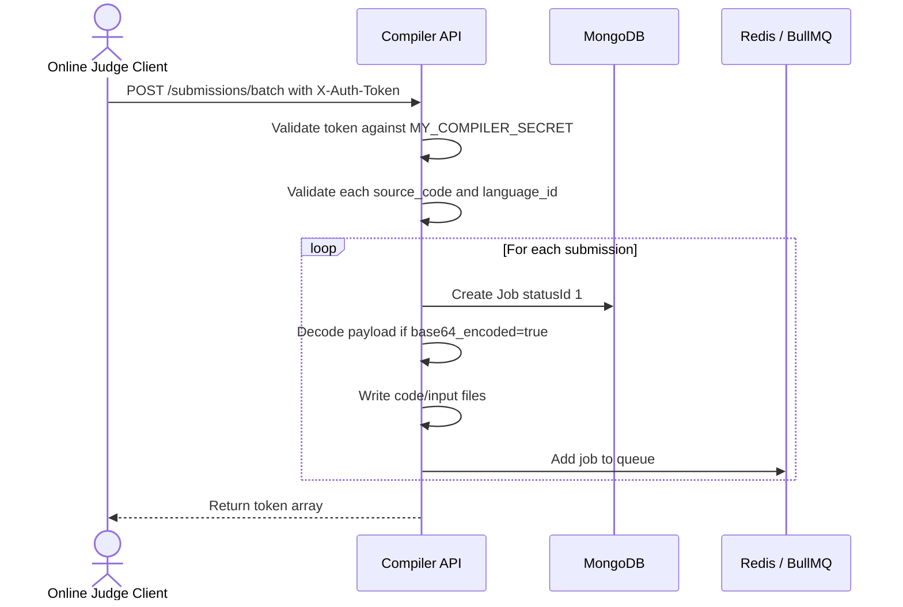

### Judge0 Batch Polling Flow

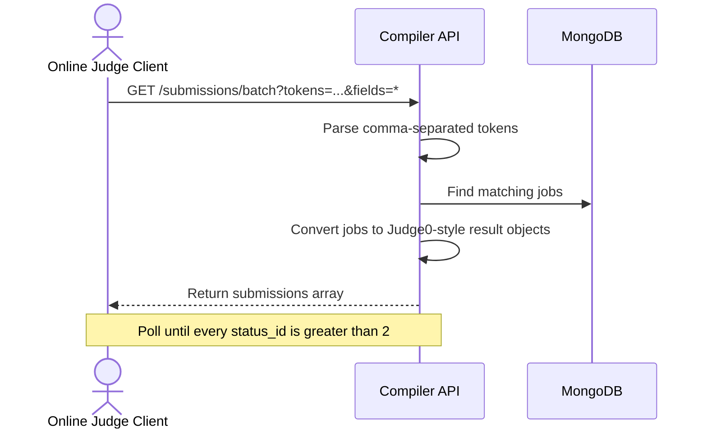

### Single Submission with wait=true Flow

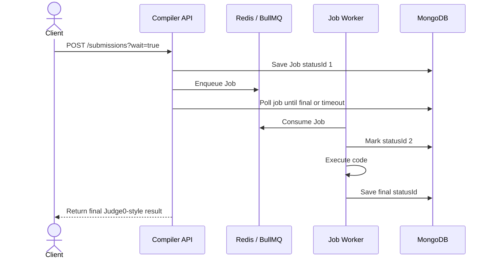

### Worker Execution Flow

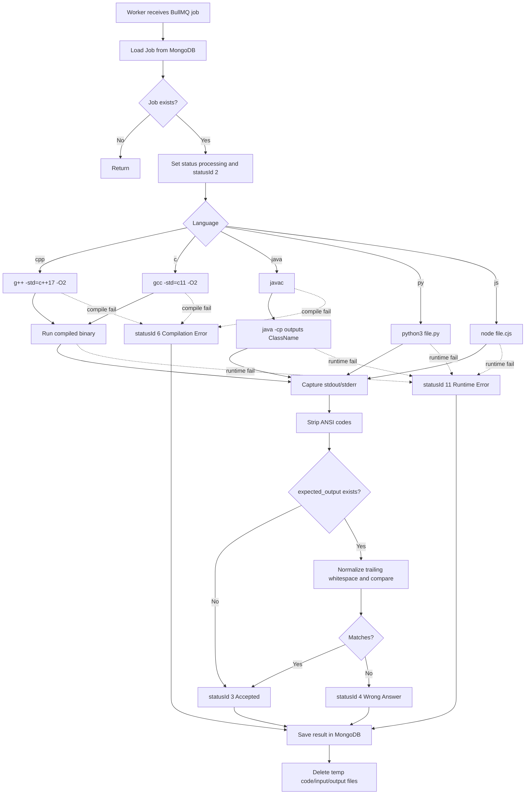

### C and C++ Execution Flow

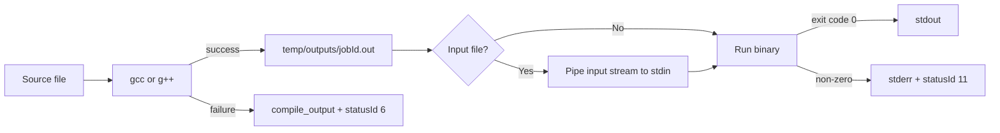

### Java Execution Flow

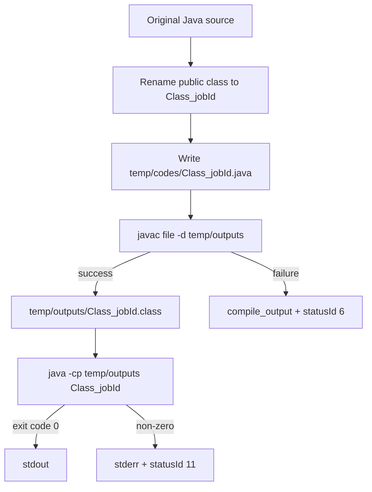

### JavaScript Execution Flow

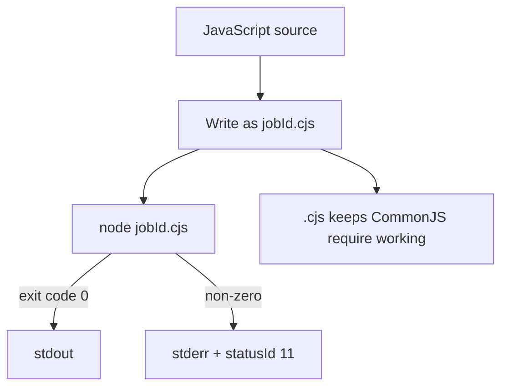

### Python Execution Flow

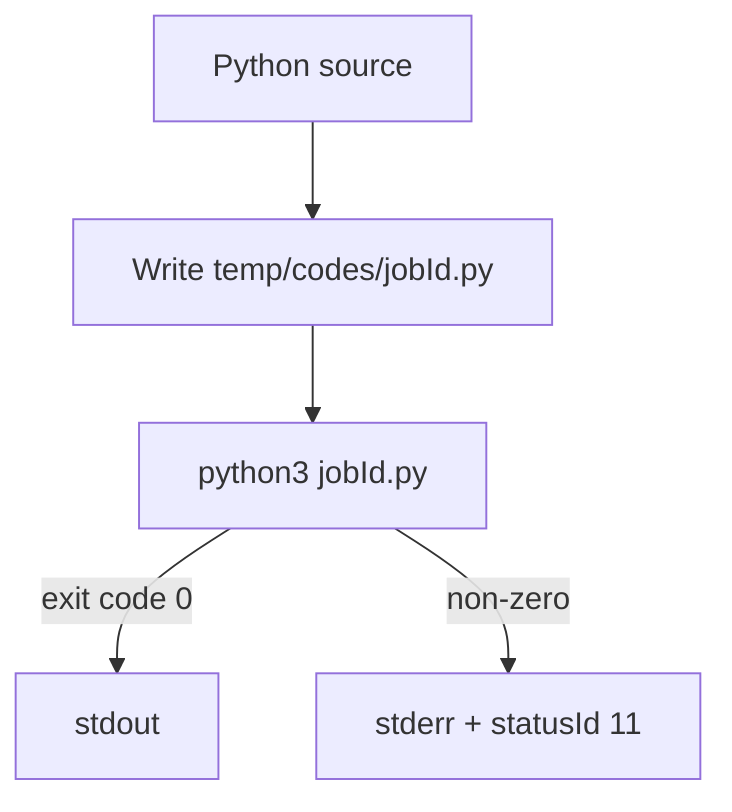

### File Generation and Cleanup Flow

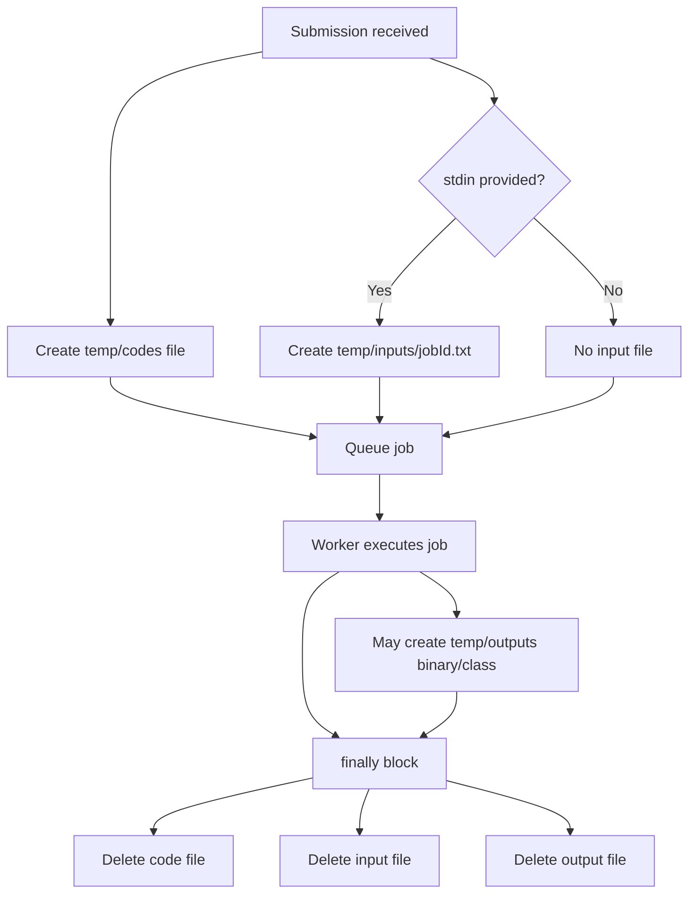

### Auth Flow for Judge0 Batch POST

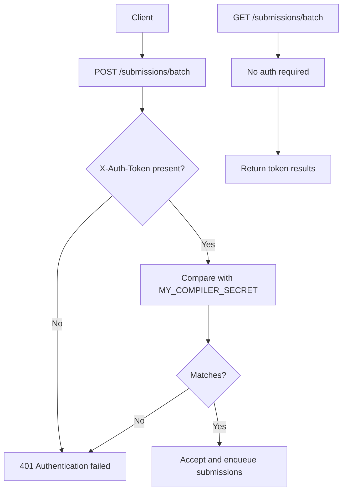

### Health Check Flow

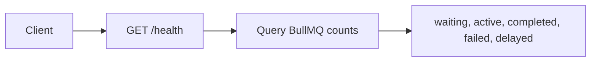

### AI Review Flow

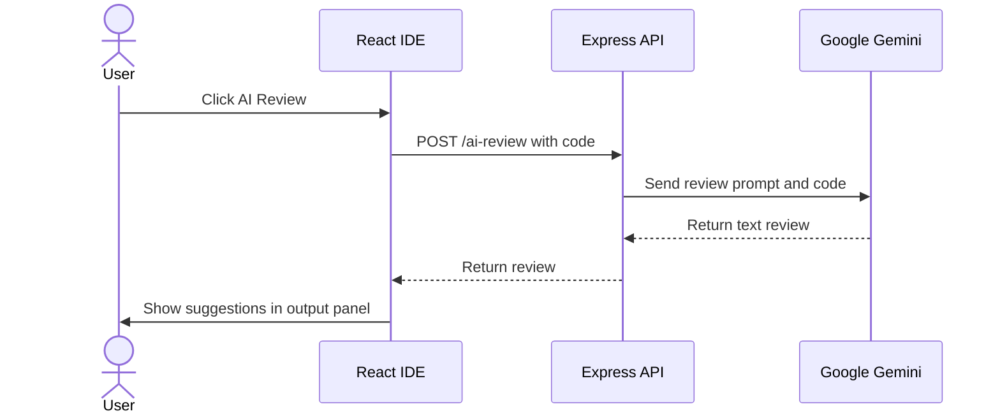

### Docker Runtime Flow

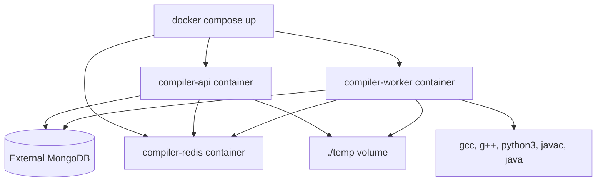

## Execution Details

### Output Comparison

When `expected_output` is provided, the worker:

1. Captures stdout.
2. Strips ANSI escape codes.
3. Removes trailing whitespace using output normalization.
4. Compares normalized stdout with normalized expected output.
5. Marks the result:
   - `status_id: 3` when output matches.
   - `status_id: 4` when output does not match.

### Time and Memory

- `time` and `wall_time` are measured with `process.hrtime.bigint()`.
- `memory` is currently stored as `null`.

### Temporary Directories

The backend creates:

```text
backend/temp/codes
backend/temp/inputs
backend/temp/outputs
```

The `.gitignore` excludes `temp/` so generated code and compiled outputs are not committed.

## Security Notes

- `POST /submissions/batch` is protected by `MY_COMPILER_SECRET`.
- `GET /submissions/batch` is public to mimic a token-polling service.
- The API and worker execute arbitrary user code. For production, run the worker in a locked-down container or sandbox.
- The current local executor uses child processes directly. This is fine for controlled local development, but production should add stronger isolation, CPU/memory limits, timeouts, and filesystem/network restrictions.
- Do not expose `.env` secrets.
- Restrict `CORS_ORIGIN` to trusted frontend/client origins.

## Troubleshooting

### POST without auth returns 201 instead of 401

Check:

- `MY_COMPILER_SECRET` is set in `backend/.env`.
- The API process was restarted after changing `.env`.
- You are calling `POST /submissions/batch`, not `POST /submissions`.

### Batch submissions stay `status_id: 1`

The API accepted the job, but the worker did not process it.

Check:

- Run `npm run local`, not only `npm start`.
- Worker logs show `Worker connected to MongoDB`.
- Redis is running.
- API and worker use the same Redis connection.
- `/health` queue counts show jobs moving from `waiting` to `active`.

### Polling gives `ECONNREFUSED` or socket hang up

Check:

- API process is still running.
- Nodemon is not restarting because of files in `temp/`.
- Use `npm run dev` or `npm run local`; the current dev script ignores `temp`.
- Worker crashes are visible in terminal logs.

### JavaScript code using `require()` fails

The generator writes JavaScript jobs as `.cjs` so CommonJS should work. Restart API and worker if you changed this recently.

### C/C++ compile fails

Check:

- `gcc` and `g++` are installed locally.
- In Docker, run the worker image, not only the API image.
- The worker container includes compilers.

### Java compile fails

Check:

- Java JDK is installed locally.
- Docker worker image includes `default-jdk-headless`.
- Submitted Java code has a public class; the generator will rename it to avoid collisions.

### Python fails

Check:

- `python3` is installed and available in PATH.
- Docker worker image includes `python3`.

### AI review fails

Check:

- `GOOGLE_GEMINI_API` is set.
- The API process was restarted after setting `.env`.
- Network access to Google Gemini is available.

### Browser frontend cannot connect

Check:

- `frontend/.env` or `.env.production` has `VITE_API_URL=http://localhost:8000`.
- Backend `CORS_ORIGIN` includes `http://localhost:5173`.
- Backend is running on the configured `PORT`.

## Useful Commands

Backend:

```bash
cd backend
npm install
npm run local
```

Backend API only:

```bash
cd backend
npm start
```

Backend worker only:

```bash
cd backend
npm run start:worker
```

Backend dev:

```bash
cd backend
npm run dev
```

Frontend:

```bash
cd frontend
npm install
npm run dev
```

Docker:

```bash
cd backend
docker compose up --build
```

Health check:

```bash
curl http://localhost:8000/health
```

Unauthorized batch POST check:

```bash
curl -i -X POST "http://localhost:8000/submissions/batch?base64_encoded=false" \
  -H "Content-Type: application/json" \
  -d '{"submissions":[]}'
```

Authorized batch POST check:

```bash
curl -i -X POST "http://localhost:8000/submissions/batch?base64_encoded=false" \
  -H "Content-Type: application/json" \
  -H "X-Auth-Token: YOUR_SECRET" \
  -d '{"submissions":[{"source_code":"print(5)","language_id":109,"expected_output":"5\n"}]}'
```

## Deployment Notes

- Deploy API and worker as separate processes/services.
- API needs MongoDB, Redis, and `MY_COMPILER_SECRET`.
- Worker needs MongoDB, Redis, and language runtimes/compilers.
- Put Redis and MongoDB on stable managed services for production.
- Use a shared temp volume only if the API writes files and worker reads the same filesystem. In this project, API and worker share `./temp` in Docker Compose.
- If API and worker run on separate machines without a shared filesystem, move source/input payload storage into MongoDB/object storage or make workers generate files from `sourceCode` and `stdin` stored in MongoDB.
- Keep `MY_COMPILER_SECRET` synchronized with any online judge project calling this compiler service.
- Keep `base64_encoded=false` if the client expects plain strings.
- Add stricter sandboxing before accepting untrusted public code execution.
